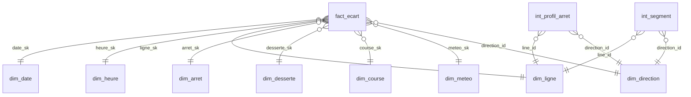

# Data model

The report reads a **star schema** built in SQL Server: one fact table, `fact_ecart`, surrounded by eight dimensions. Two intermediate tables feed the spatial analysis, and a few small disconnected tables drive specific visuals. All tables are built by the numbered scripts in [`sql/`](../sql/README.md); Power BI only adds measures and two columns computed in Power Query.

## Diagram



All relationships are many-to-one, filtering in a single direction, from the dimension to the fact table. Dimensions are never related to each other (no snowflake): `dim_desserte` also holds a `line_id`, but it is not linked to `dim_ligne`, so every filter reaches the facts by one path only.

## The fact table: `fact_ecart`

**Grain: one stop event**, that is one scheduled stop event, one observed stop event, or both once matched. About 3.67 million rows over 52 days.

**Why this grain.** The first design was "stop × trip × date". It could not hold an observed stop event with no scheduled counterpart, since such a vehicle has no trip. The three outcomes of the matching (matched, scheduled only, observed only) therefore live in the same table, and every rate can be computed from it alone.

| Group | Columns | Notes |
|---|---|---|
| Keys | `ecart_sk` (primary key), `date_sk`, `heure_sk`, `ligne_sk`, `arret_sk`, `desserte_sk`, `course_sk`, `meteo_sk`, `direction_id` | 8 foreign keys, all enforced in SQL Server |
| Counters (0/1) | `nb_theorique`, `nb_reel`, `nb_apparie`, `nb_theo_seul`, `nb_reel_seul` | Result of the matching |
| Cascade (0/1) | `nb_conforme`, `nb_avance`, `nb_retard` | On time, early, late. With `nb_theo_seul`: `nb_conforme + nb_avance + nb_retard + nb_theo_seul = nb_theorique` on every row |
| Times (s) | `theorique_sec`, `reel_sec`, `retard_sec`, `ecart_abs_sec`, `tolerance_sec` | `retard_sec` is censored at the line's tolerance |
| Quality | `nb_obs`, `fraicheur_sec` | Number of cycles in which the vehicle was seen, age of the last prediction |
| Descriptive | `statut_appariement`, `heure_est_reelle`, `methode_resolution`, `feed_version`, `destination_rt`, `retard_bin` | `retard_bin` groups deviations in 20 s classes for the histogram |

**Additive counters instead of a status column.** Each row carries 0/1 flags, so every indicator is a ratio of two sums:

```
On-time rate  = SUM(nb_conforme) / SUM(nb_theorique)
Matching rate = SUM(nb_apparie)  / SUM(nb_theorique)
```

A ratio of sums stays correct at any level (network, mode, line, stop, day, hour) without any special filter logic in DAX. Averaging per-line rates, by contrast, would give a small line the same weight as a busy one.

## Dimensions

| Table | Grain | Key | Main attributes |
|---|---|---|---|
| `dim_date` | One service date, 1 July to 31 August | `date_sk` = `YYYYMMDD` | Weekday, week, public holiday, GTFS feed, `est_collecte` |
| `dim_heure` | One 15-minute slot (96 slots) | `heure_sk` = `HHMM` | Collection window and analysis window flags |
| `dim_ligne` | One line | `ligne_sk` | Real mode (from `route_type`), replacement service, ranking flag and exclusion reason, sort order |
| `dim_arret` | One real-time stop (2,292) | `arret_sk` | Name, coordinates, number of ranked lines serving the stop, interchange class |
| `dim_desserte` | Line × direction × stop | `desserte_sk` | Geographic order of the stop along the route, display label |
| `dim_course` | One trip as published (`feed_version`, `trip_id`) | `course_sk` | Start and end times, number of stops, truncation flags, route variant |
| `dim_meteo` | One hour | `meteo_sk` = `YYYYMMDDHH` | Temperature, rain, wind, classes |
| `dim_direction` | One direction | `direction_id` | Outbound, Inbound, Unknown direction |

**Design choices**

- **Materialised surrogate keys.** Keys are generated once and stored in tables, never computed in a view: a `ROW_NUMBER()` in a view is recalculated at every query, so a key could point to another row the next day, silently.
- **Readable keys where they help.** `date_sk`, `heure_sk` and `meteo_sk` are built from the date or time (`20260715`, `915`), which makes checks easy and sorts naturally.
- **Unknown members (`-1`), only where a missing link is expected.** `dim_course`, `dim_desserte`, `dim_meteo` and `dim_direction` have a row `-1`: an observed stop event with no scheduled counterpart has no trip (`course_sk = -1`), and August has no weather data (`meteo_sk = -1`). This keeps every foreign key valid without losing rows. `dim_date`, `dim_heure`, `dim_ligne` and `dim_arret` have none on purpose: a missing date, slot, line or stop would be an error, so the foreign key makes the pipeline fail instead of hiding it.
- **Service date, not calendar date.** A trip starting before midnight belongs to the day it started, as in GTFS.
- **The fact table links to the scheduled time.** `heure_sk` comes from the scheduled time when there is one. Linking to the observed time would move a late vehicle into a later slot, and the dimension used to measure the delay would itself depend on the delay.
- **Days without data stay in `dim_date`.** The five missing collection days appear with `est_collecte = 0`, so a gap is visible on a time axis rather than hidden.
- **Two line dimensions would be wrong.** `dim_ligne` (one row per line) and `dim_desserte` (one row per line, direction and stop) have different grains. Merging them would repeat line attributes on every stop and break the sort columns Power BI needs.

## Other tables in the model

| Table | Grain | Role |
|---|---|---|
| `int_profil_arret` | Line × direction × stop | Median, 10th and 90th percentile of the delay at each stop (Zoom page, delay along the route) |
| `int_segment` | Line × direction × segment between two consecutive stops | Median gap between actual and scheduled running time (Zoom page, segments that lose time) |
| `diag_non_apparies` | One cause (4 rows) | Causes of unmatched stop events (Method page). Loaded **without relationship**: it is already aggregated, a link to the fact table would count rows twice |

These two `int_` tables are pre-aggregated in SQL because medians and percentiles over millions of rows are faster and easier to check there than in DAX.

**Disconnected tables** (created in Power BI, no relationship). They provide the values of an axis or a slicer, and a measure reads the selected value:

| Table | Content | Used by |
|---|---|---|
| `Cascade_postes` | The 4 categories in display order | Home page bar chart (`Category share`) |
| `Sensibilite_tolerance` | Tolerances from 30 s to 180 s, 15 s steps | Sensitivity curve on the Method page |
| `Choix_indicateur` | The indicators the user can choose from | Explore page heat map |
| `Tranches_effet` | Ranges of stop-specific effect | Histogram on the Stops page |

## Measures

All measures are stored in the `_Mesures` table and grouped in display folders. Each one has a description in the model. The main ones:

| Measure | Definition |
|---|---|
| `Scheduled stop events` | `SUM(nb_theorique)`, the denominator of every rate |
| `On-time rate` | On-time stop events / scheduled stop events |
| `Matching rate` | Matched stop events / scheduled stop events |
| `Early share`, `Late share`, `Not found share` | The other three categories of the cascade |
| `Cascade check` | On time + early + late + not found − scheduled. Must be 0 under any filter: a built-in test |
| `Network on-time rate` | On-time rate ignoring line and mode filters, the fixed reference for comparisons |
| `Gap to network average` | Line rate minus network rate, in points |
| `Network rank` | Rank of a line among the 71 ranked lines |
| `Stop on-time rate (reliable)` | On-time rate, blank under 200 scheduled stop events |
| `Stop-specific effect` | Observed rate at a stop minus the rate expected from the lines serving it |
| `7-day on-time rate` | Rolling rate over 7 days, computed as a ratio of sums over the window, not an average of daily rates |
